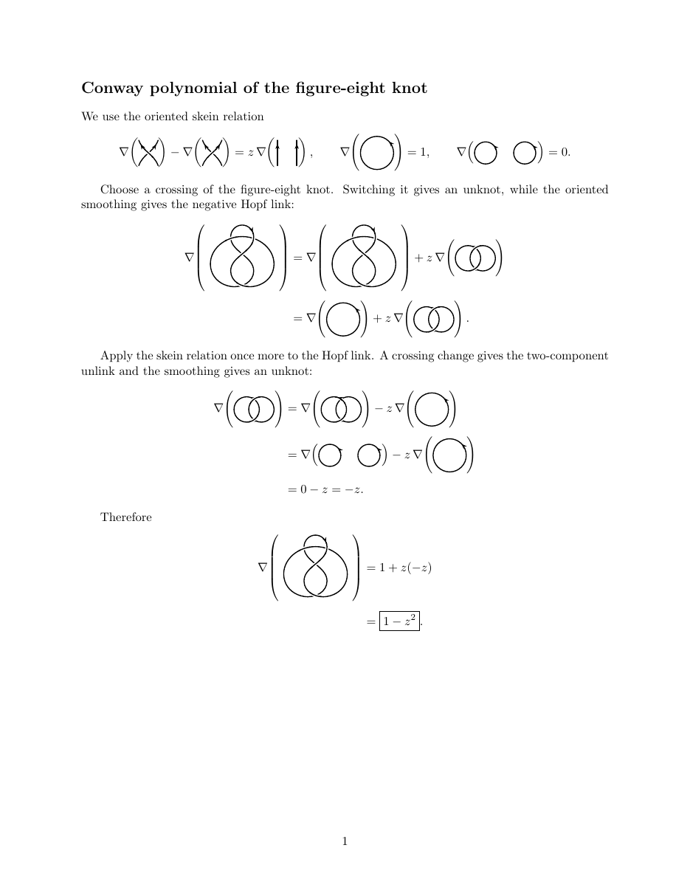
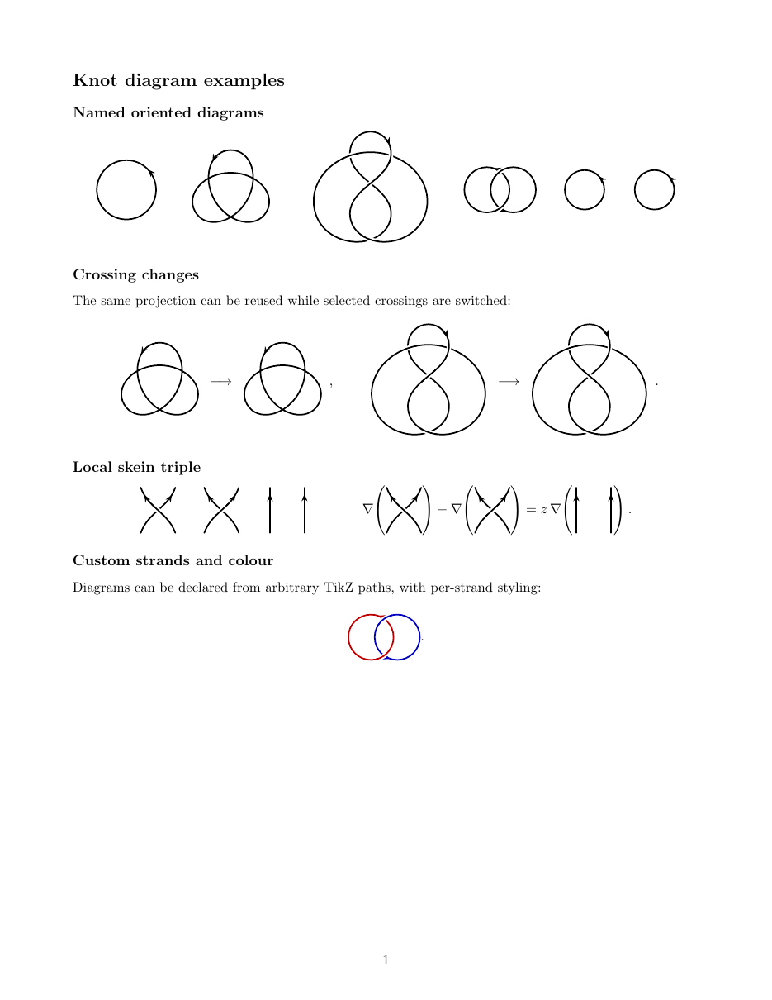

# latex-knots

`knotdiag` is a small LaTeX package for inline, oriented knot diagrams
and skein calculations. It wraps TikZ's `knots` and `hobby` libraries
with named diagrams, crossing changes, consistent crossing gaps, and
direction arrows.

```latex
\usepackage{knotdiag}

\[
  \nablaknot{figureeight}
  \qquad
  \kd[change=2]{figureeight}
  \qquad
  \skeinrel
\]
```

Global and per-diagram options include `scale`, `line width`, `gap`,
`arrows`, `flip`, and `change`.

## Examples

- Conway polynomial of the figure-eight knot:
  [source](examples/conway-figure-eight.tex) ·
  [rendered PDF](examples/conway-figure-eight.pdf)  
  Full skein calculation of \(\nabla(4_1)=1-z^2\).

  [](examples/conway-figure-eight.pdf)

- Knot diagram gallery:
  [source](examples/gallery.tex) ·
  [rendered PDF](examples/gallery.pdf)  
  Named diagrams, crossing changes, a local skein triple, and custom
  coloured strands.

  [](examples/gallery.pdf)

Compile from the repository root with:

```sh
TEXINPUTS=.: pdflatex examples/conway-figure-eight.tex
TEXINPUTS=.: pdflatex examples/gallery.tex
```

Requires a recent TeX distribution with TikZ, `spath3`, `hobby`,
`amsmath`, and `expl3`.